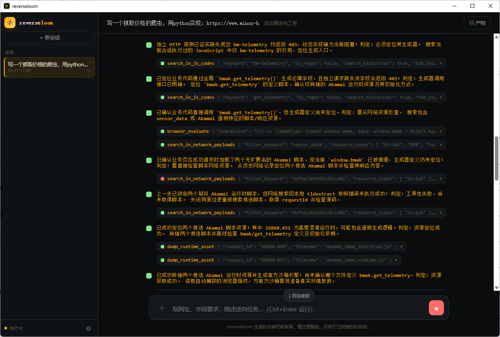
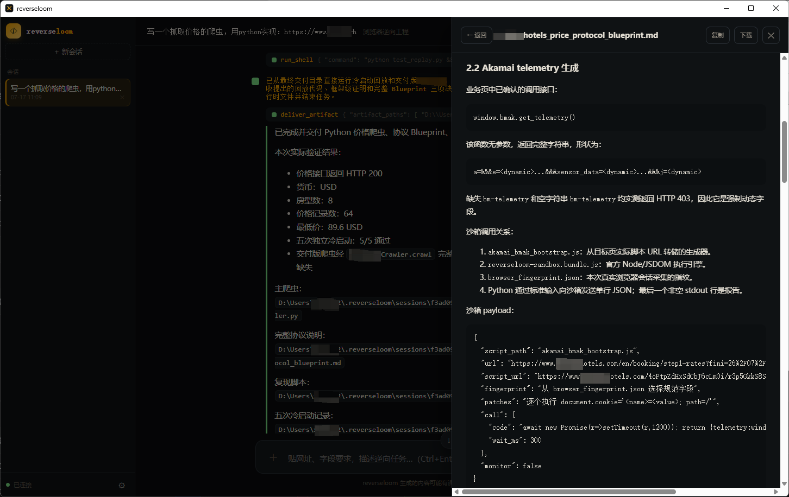
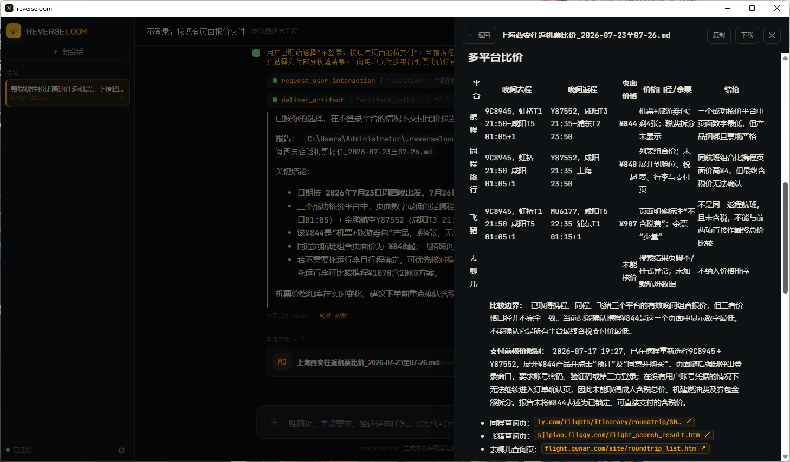
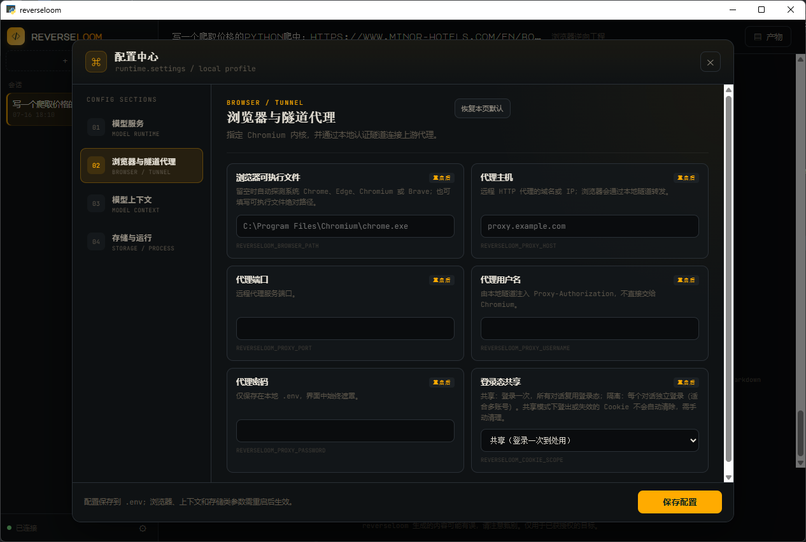

<div align="center">


# reverseloom

### 🕸️ Hand the whole browser to an LLM — it gets in, reverses the protocol, and writes a crawler that runs without a browser.

**It just beat Akamai Bot Manager, hands-off, end-to-end. [See the run ↓](#real-run)**

[](https://www.python.org/)
[](https://github.com/KuiChi-x/graphloom)
[](https://github.com/Kaliiiiiiiiii-Vinyzu/patchright)
[](https://github.com/KuiChi-x/kc-browser)
[](LICENSE)


[](https://github.com/KuiChi-x/reverseloom/releases/download/1.0.0/reverseloom_win.zip)

[中文](README.zh-CN.md) · **English** · [Three walls](#three-walls) · [Full power](#full-power) · [Quick start](#quick-start) · [Capabilities](#capabilities)

</div>

<a id="real-run"></a>

---

**One prompt — "write me a price crawler for this site" — on a target behind Akamai Bot Manager.**

<div align="center">

</div>

<sub>① Detects that a missing `bm-telemetry` header returns 403. Breakpoints `bmak.get_telemetry()`, dumps `akamai_bmak_bootstrap.js` + `akamai_bmak_runtime.js` straight off the page.</sub>

<div align="center">

</div>

<sub>② Reproduces the sensor in the Node sandbox — no browser — and ships a standalone Python crawler: **HTTP 200 · 64 price records · 5/5 cold-start replays.** Done.</sub>

---

<a id="three-walls"></a>

## 🧱 Scraping has three walls. reverseloom tears through all of them.

| | The wall | The usual way | reverseloom |
|---|---|---|---|
| 🧱 **Wall 1** | **Can't get in** — bot detection blocks you | patched fingerprints, still leaking `navigator.webdriver` + CDP traces | pair with [**kc-browser**](https://github.com/KuiChi-x/kc-browser): C++ kernel-level fingerprint, grows from inside the engine — no script to unwrap |
| 🧱 **Wall 2** | **Can't reverse it** — data is signed / tokenized / encrypted | hand-reading obfuscated JS, a full day per algorithm | observer full-exposure + CDP breakpoints: model traces the generator, reproduces it in a sandbox — 5/5 cold-start replays required |
| 🧱 **Wall 3** | **Can't run it** — crawler still needs a browser attached | headless browser resident forever | ships a **browser-free, cold-start-ready** pure-code crawler |

Other tools stop at one wall. reverseloom welds **get in → reverse → ship a standalone crawler** into one chain.

## 🆚 vs. ordinary browser agents

| | Ordinary browser agent | **reverseloom** |
|---|---|---|
| What the model sees | screenshot + clickable elements | ✅ **fully exposed**: DOM + screenshot + network + JS debugger |
| Signed / encrypted params | gets stuck or hallucinates | ✅ traces the generator → reproduces it in a sandbox |
| Context | screenshots pile into history, blows up fast | ✅ observer overwrite-injection; history keeps only reasoning |
| Deliverable | one-off action result | ✅ a **crawler that runs cold, browser-free** |
| Runs | mostly cloud SaaS | ✅ fully local, data never leaves |

Why observer, not tool-return-into-history? Browser state changes every turn and is huge — piling it into history blows the context window. reverseloom injects only the *current* snapshot per turn (overwrite, never stored), so long reverse-engineering sessions stay lean.

<a id="quick-start"></a>

## 🚀 Quick start

**Prerequisite:** a Chromium-based browser installed (Chrome / Edge / Chromium / Brave). reverseloom only drives it — it **never downloads Chromium**.

### Option A — download & run (Windows)

1. Download [**reverseloom_win.zip (v1.0.0)**](https://github.com/KuiChi-x/reverseloom/releases/download/1.0.0/reverseloom_win.zip), unzip, double-click `reverseloom.exe`.
2. In **Settings → Model**, fill `BASE_URL` / `API Key` / `MODEL`, save. Chatting in 3 minutes.

The EXE ships its own Python runtime, so generated crawlers run via `run_shell` with zero setup.

### Option B — from source (macOS / Linux / devs)

```bash
git clone https://github.com/KuiChi-x/reverseloom.git && cd reverseloom
pip install -e .               # pulls graphloom + patchright from PyPI; no `patchright install chromium`
python -m reverseloom          # native desktop window
python -m reverseloom --web    # or serve, open in your browser
```

For local development (tests, lint, agent-generated crawlers), use `pip install -e ".[dev,crawler]"` — see [docs/development.md](docs/development.md).

The Node sandbox ships prebuilt (`reverseloom-sandbox.bundle.js`) — works out of the box.

### Configure

In the UI under **Settings → Model**, or via `.env`. The model must support **image input + streaming output**.

<div align="center"></div>

```dotenv
MODEL_PROTOCOL=openai          # openai / anthropic / gemini / deepseek / ollama
BASE_URL=https://api.openai.com/v1
OPENAI_API_KEY=sk-...
MODEL=gpt-4o
```

| Env var | Purpose |
|---|---|
| `REVERSELOOM_BROWSER_PATH` | Force a specific browser (e.g. kc-browser). Leave empty to auto-detect Chrome → Edge → Chromium → Brave. |
| `REVERSELOOM_PROXY_HOST/PORT/USERNAME/PASSWORD` | Optional upstream proxy; auth injected by a local tunnel |

> ⚠️ `run_shell` executes arbitrary commands — only point it at paths you trust.

<a id="capabilities"></a>

## 🛠️ Capabilities (30+ tools)

<div align="center"></div>

<p align="center"><sub>"Compare round-trip fares for me." It drives four travel sites and reports back — even flagging where a login wall blocked it from confirming the tax-inclusive total, instead of making a number up.</sub></p>

<details>
<summary><b>🌐 Browser automation</b></summary>

`browser_navigate` / `browser_click` (ocId or pixel) / `browser_type` / `select_option` / `press_key` / `scroll_page` / `browser_drag` (WindMouse humanized path for sliders) / tabs / `browser_evaluate` / `reset_browser_state`
</details>

<details>
<summary><b>🔬 JS reverse-engineering · CDP</b></summary>

- **Breakpoints**: `set_line_breakpoint` / `break_on_request` / `get_paused_state` / `evaluate_in_call_frame` / `step_execution`
- **Network**: `search_in_network_payloads` / `inspect_network_request` (with initiator stack)
- **Scripts**: `search_in_js_codes` / `get_script_source` / `dump_runtime_asset`
- **C++ Native binding trace** *([kc-browser](https://github.com/KuiChi-x/kc-browser) only)*: auto-written under `<session>/_native_trace/**.jsonl` — hash pre-images + native leaf values for sandbox environment rebuild when CDP alone is not enough. Stock Chrome/Edge ignore the flag and emit nothing.
</details>

<details>
<summary><b>👁️ Vision + human hand-off</b></summary>

- `visual_locate` — multimodal coordinate location (captchas, canvas, non-enumerable targets)
- `request_user_interaction` — pause for login / captcha / clarification, then resume
</details>

<details>
<summary><b>📁 File / shell · 🧩 Skills</b></summary>

- `read_file` / `write_file` / `edit_file` / `list_dir` / `search_code` / `run_shell`
- `web-crawl` / `deep-reverse` — loaded on demand, never pollute context
- Custom skills: `~/.reverseloom/skills/<name>/SKILL.md`, auto-discovered on launch
</details>

## 🧬 Architecture

```
┌─────────────────────────────  graphloom  ─────────────────────────────┐
│  agent loop · short-term memory · context compaction · observer · skills │
└───────────────────────────────────┬────────────────────────────────────┘
                                     │  reverseloom contributes ↓
      ┌──────────────┬───────────────┼───────────────┬──────────────┐
  browser mgmt      tool groups    system prompt     web shell     Node sandbox
 (patchright+CDP)  (automation/     (reverse review) (FastAPI+WS)  (jsdom repro)
                    reverse/vision)
```

- **Browser**: patchright auto-launches your system Chromium; each session gets its own profile, fingerprint launch args (`--fp-seed` / `--fp-timezone` / `--fp-platform`), optional proxy tunnel, and a per-page CDP handler for lossless network capture + JS debugging.
- **Sandbox**: run a dumped sign/token/encryption generator offline in Node + jsdom — anti-detection armor + deep-Proxy monitoring. Feed it a payload, get back the result, missing-API todo list, and captured network.
- **C++ Native binding trace** *([kc-browser](https://github.com/KuiChi-x/kc-browser) only)*: when `REVERSELOOM_BROWSER_PATH` points at kc-browser, each session is launched with `--fp-native-trace-dir=<session>/_native_trace`. The engine records native API reads/calls as JSONL keyed by `line:column` — hash inputs in plaintext (`TextEncoder.encode` / `digest` / `JSON.stringify` args) plus exact leaf values (`BatteryManager.level`, `NetworkInformation.rtt`, …). When sandbox environment rebuild stalls, the `deep-reverse` skill reads that trace as an oracle instead of guessing missing APIs. Stock Chrome/Edge ignore the flag; an empty `_native_trace` dir means the browser did not emit one.

<a id="full-power"></a>

## 🥷 Full power: pair with kc-browser

Wall 1 has a full-power answer in the sibling project [**kc-browser**](https://github.com/KuiChi-x/kc-browser). Ordinary anti-detection patches the JS layer — patches leave seams. kc-browser modifies **Chromium's C++ kernel**, so the fingerprint grows from the engine up: UA / Client Hints / WebGL / Canvas / Audio / fonts / hardware all self-consistent, no injectable script, no `navigator.webdriver`. One 64-bit seed = one identity; rotate without restarting.

reverseloom already speaks its flags — just point `REVERSELOOM_BROWSER_PATH` at kc-browser (or set it under **Settings → Browser**). Regular Chrome works too; the flags are simply ignored.

<div align="center"></div>

## 📂 Project layout

```
src/reverseloom/
  __main__.py    desktop entry (pywebview)
  agent/         assembly, model adapter, prompts
  runtime/       config, settings, persistence
  browser/       manager · session · cdp_handler · proxy · fingerprint
                 observer · dom/ · sandbox_env/ (Node + jsdom)
  tools/         filesystem · browser/{automation,investigation,visual}
  web/           HTTP + WebSocket adapters
```

## ⚖️ Compliance

For **research, testing, and authorized data integration** only. Operate only on sites you own or are authorized to test; comply with each site's ToS, `robots.txt`, and local law. Reversing signatures, bypassing captchas, and using fingerprints/proxies may violate some sites' terms — **the risk is entirely yours.** Contributors are not responsible for misuse.

## 🧩 The family — one pipeline

| Project | Layer | One line |
|---|---|---|
| [**kc-browser**](https://github.com/KuiChi-x/kc-browser) | 🥷 get in | C++ kernel-level anti-detect fingerprint browser |
| [**reverseloom**](https://github.com/KuiChi-x/reverseloom) | 🔬 reverse | observer full-exposure + CDP + sandbox → browser-free crawler (this repo) |
| [**graphloom**](https://github.com/KuiChi-x/graphloom) | 🧵 drive | the agent framework underneath — observer, compaction, skills |

## ⭐ Star History

If it saved you hours of reverse-engineering, a Star on all three helps 👇

[](https://star-history.com/#KuiChi-x/reverseloom&KuiChi-x/kc-browser&KuiChi-x/graphloom&Date)

## 📄 License

[Apache 2.0](LICENSE) © KuiChi-x · [Issues](https://github.com/KuiChi-x/reverseloom/issues) · [中文文档](README.zh-CN.md)

<sub><b>Keywords</b> · browser agent · web / JS reverse engineering · anti-bot · CDP debugging · sign / token / encryption cracking · captcha bypass · crawler generator · LLM agent<br/>
<b>关键词</b> · 浏览器 Agent · 网页逆向 · JS 逆向 · 爬虫 · 反爬 · 验证码破解 · 签名/加密还原 · 断点调试 · 数据采集 · 大模型智能体</sub>
